# montessori-api

Production-grade multi-tenant Montessori ERP & LMS — Backend API

> **The backend copy of all Zod schemas is authoritative. If `montessori-web` schemas drift, the backend wins.**

---

## Quick Start (Docker — recommended)

```bash
git clone <repo>
cd montessori-api
cp .env.example .env          # fill in real secrets
docker-compose up --build     # starts postgres + redis + api
# In a second terminal:
docker-compose exec api npm run db:migrate
docker-compose exec api npm run db:seed
```

API available at **http://localhost:4000**  
Swagger docs at **http://localhost:4000/api/docs**

### Without Docker

```bash
# Requires: Node 20+, PostgreSQL 16, Redis 7
npm install
cp .env.example .env          # fill in DATABASE_URL, REDIS_URL, JWT secrets
npm run db:migrate:dev
npm run db:seed
npm run dev
```

---

## Environment Variables

| Variable | Required | Description |
|---|---|---|
| `NODE_ENV` | No | `development` \| `production` (default: development) |
| `PORT` | No | Server port (default: 4000) |
| `DATABASE_URL` | **Yes** | PostgreSQL connection string |
| `REDIS_URL` | No | Redis connection string (default: redis://localhost:6379) |
| `JWT_ACCESS_SECRET` | **Yes** | Min 64-char secret for access tokens |
| `JWT_REFRESH_SECRET` | **Yes** | Min 64-char secret for refresh tokens |
| `JWT_ACCESS_EXPIRY` | No | Access token TTL (default: 15m) |
| `JWT_REFRESH_EXPIRY` | No | Refresh token TTL (default: 7d) |
| `SMTP_HOST` | No | SMTP hostname for transactional email |
| `SMTP_PORT` | No | SMTP port (default: 587) |
| `SMTP_USER` | No | SMTP username |
| `SMTP_PASS` | No | SMTP password |
| `EMAIL_FROM` | No | From address for emails |
| `CLOUDINARY_CLOUD_NAME` | No | Cloudinary cloud (file uploads) |
| `CLOUDINARY_API_KEY` | No | Cloudinary key |
| `CLOUDINARY_API_SECRET` | No | Cloudinary secret |
| `GROK_API_KEY` | No | xAI Grok API key — **never expose to frontend** |
| `GROK_MODEL` | No | Grok model name (default: grok-4) |
| `CORS_ORIGINS` | No | Comma-separated allowed origins |
| `FRONTEND_URL` | No | Frontend URL for email links |
| `RATE_LIMIT_WINDOW_MS` | No | Rate limit window in ms (default: 900000) |
| `RATE_LIMIT_MAX` | No | Max requests per window (default: 100) |
| `AUTH_RATE_LIMIT_MAX` | No | Max auth requests per 15min (default: 10) |

---

## Demo Credentials

All passwords: `Demo@1234`

| Email | Role | Notes |
|---|---|---|
| `superadmin@platform.com` | SUPER_ADMIN | Platform-level, no org |
| `principal@sunrise.edu` | ORG_ADMIN | Sunrise Montessori Academy |
| `branchadmin@sunrise.edu` | BRANCH_ADMIN | Main Campus |
| `teacher@sunrise.edu` | TEACHER | Lead Teacher, Sunflower Room |
| `guide@sunrise.edu` | GUIDE | Oak Room |
| `finance@sunrise.edu` | FINANCE_STAFF | Finance team |
| `hr@sunrise.edu` | HR_STAFF | HR team |
| `frontdesk@sunrise.edu` | FRONT_DESK | Reception |
| `parent1@example.com` | PARENT | Robert Johnson (father of Alex) |
| `parent2@example.com` | PARENT | Emily Johnson (mother of Alex — 2nd guardian) |
| `parent3@example.com` | PARENT | Carlos Rivera (father of Sofia) |
| `student@sunrise.edu` | STUDENT | Alex Johnson |

---

## Marking Scheme — Where to Find It

| Category | Demonstrated in |
|---|---|
| **Database design (50)** | `prisma/schema.prisma` — 55+ models, full relations, indexes; ERD below |
| **Required features (100)** | All modules in `src/modules/` — auth, students, attendance, curriculum, observations, finance, HR, inventory, communication, gamification |
| **UI/UX (50)** | `montessori-web` repo — role-tinted shells, design tokens, responsive layouts |
| **AI + Offline-first (20)** | `src/modules/ai/`, `src/jobs/aiInsightsWorker.js`, `montessori-web/lib/offline/` |
| **Additional features (20)** | Day-in-review digest, photo observation tagging, classroom material tracker, multi-language UI, conference report PDF |
| **Documentation & GitHub (10)** | This README, `docs/`, seed script, Swagger at `/api/docs` |

---

## API Reference

Swagger UI: **http://localhost:4000/api/docs**

All endpoints are versioned at `/api/v1`. Authentication via `Authorization: Bearer <accessToken>`.

### Core Route Groups

| Prefix | Description |
|---|---|
| `/api/v1/auth` | Registration, login, token refresh, invite flow |
| `/api/v1/students` | Student profiles, guardians, progress |
| `/api/v1/classrooms` | Classroom management |
| `/api/v1/attendance` | Mark, QR scan, analytics |
| `/api/v1/curriculum` | Areas, milestones, lesson plans, materials |
| `/api/v1/observations` | Observation logging, media upload |
| `/api/v1/finance` | Fees, invoices, payments, expenses, ledger |
| `/api/v1/hr` | Staff, payroll, leave, timesheets |
| `/api/v1/inventory` | Items, stock movements, purchase orders |
| `/api/v1/communication` | Announcements, messages, notifications |
| `/api/v1/gamification` | Badges, points, streaks, leaderboards |
| `/api/v1/ai` | Chat assistant, insight feed, photo tagging |
| `/api/v1/sync` | Offline push/pull, conflict resolution |

---

## Offline Sync Endpoints

| Endpoint | Method | Description |
|---|---|---|
| `/api/v1/sync/push` | POST | Push a batch of offline writes (up to 100 items) |
| `/api/v1/sync/pull` | GET | Pull server-side delta since a timestamp |
| `/api/v1/sync/conflicts` | GET | List unresolved conflicts for manual review |
| `/api/v1/sync/conflicts/:id/resolve` | PATCH | Resolve a conflict (SERVER_WINS / CLIENT_WINS / MANUAL) |

Conflict strategy:
- **Simple fields** (attendance status, mastery level): last-write-wins
- **Ambiguous** (same observation edited on two devices): flagged as `CONFLICT` in `SyncLog`, surfaced in the UI for manual resolution — never silently overwritten

---

## Entity-Relationship Diagram

```mermaid
erDiagram
    Organization ||--o{ Branch : has
    Organization ||--o{ User : has
    Organization ||--o{ Role : has
    Organization ||--o{ AcademicYear : has
    Organization ||--o{ Curriculum : has
    Organization ||--o{ FeeStructure : has
    Organization ||--o{ AIInsight : receives

    Branch ||--o{ Classroom : contains
    Branch ||--o{ Staff : employs

    User ||--o{ UserRole : assigned
    User ||--o{ RefreshToken : holds
    User ||--o| Staff : is
    User ||--o| Guardian : is
    User ||--o| Student : is
    Role ||--o{ RolePermission : grants
    Permission ||--o{ RolePermission : included_in

    Classroom ||--o{ Enrollment : contains
    Classroom ||--o{ AttendanceRecord : records
    Classroom ||--o{ LessonPlan : schedules
    Classroom ||--o{ ClassroomStaff : staffed_by
    Classroom ||--o{ Leaderboard : hosts

    AcademicYear ||--o{ Classroom : organizes
    AcademicYear ||--o{ Enrollment : covers

    Student ||--o{ Enrollment : has
    Student ||--o{ StudentGuardian : linked_to
    Student ||--o| MedicalInfo : has
    Student ||--o{ EmergencyContact : has
    Student ||--o{ AttendanceRecord : generates
    Student ||--o{ Observation : receives
    Student ||--o{ StudentProgress : tracks
    Student ||--o{ StudentBadge : earns
    Student ||--o{ PointsLedger : accumulates
    Student ||--o{ Streak : maintains
    Student ||--o{ Invoice : billed_via

    Guardian ||--o{ StudentGuardian : links

    Curriculum ||--o{ CurriculumArea : contains
    CurriculumArea ||--o{ Milestone : defines
    CurriculumArea ||--o{ LessonPlan : linked_to
    CurriculumArea ||--o{ Observation : categorizes
    CurriculumArea ||--o{ StudentProgress : measures

    Staff ||--o{ ClassroomStaff : assigned_to
    Staff ||--o{ Observation : logs
    Staff ||--o{ LessonPlan : creates
    Staff ||--o{ Payroll : receives
    Staff ||--o{ LeaveRequest : submits
    Staff ||--o{ StaffAttendance : records
    Staff ||--o{ Timesheet : submits

    Invoice ||--o{ InvoiceLineItem : contains
    Invoice ||--o{ Payment : receives
    FeeStructure ||--o{ InvoiceLineItem : prices

    InventoryItem ||--o{ StockMovement : tracks
    InventoryItem ||--o{ PurchaseOrderLine : ordered_via
    PurchaseOrder ||--o{ PurchaseOrderLine : contains
    Supplier ||--o{ PurchaseOrder : fulfils
    Supplier ||--o{ InventoryItem : supplies

    Badge ||--o{ StudentBadge : awarded_as
    Leaderboard ||--o{ LeaderboardEntry : ranks

    AIConversation ||--o{ AIMessage : contains

    SyncQueue ||--o{ SyncLog : resolved_in
```



---

## Architecture Notes

- **Multi-tenancy**: Every tenant-scoped table carries `organizationId`. The Prisma middleware in `src/middleware/tenantScope.js` enforces isolation — `organizationId` is derived from the JWT, never from client input.
- **RBAC**: `Role → RolePermission → Permission` join-table pattern. Permission checks use `requirePermission('key')` middleware, never hardcoded role strings. Admins can customize role → permission mapping without a deploy.
- **Auth**: Short-lived access token (15m) + rotating refresh token (argon2-hashed, 7d). Refresh token rotation on every use; replay detection via hash verification scan.
- **Real-time**: Socket.IO rooms per org (`org:<id>`), classroom (`classroom:<id>`), and user (`user:<id>`) for live attendance and notifications.
- **AI**: Grok (xAI) via OpenAI-compatible SDK. Function-calling tools ground every response in real DB data. Nightly BullMQ job generates written insights. API key never leaves the backend.
- **Offline**: `/api/v1/sync/push` + `/pull` endpoints. Conflicts are logged to `SyncLog` with `resolution: MANUAL` for UI surfacing.
